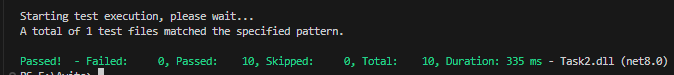

# Тестовое задание на стажировку QA в Авито

Этот репозиторий содержит выполненные задания для стажировки по направлению **QA**.

---

## Задание 1  
В папке проекта расположен файл:

- **TASK1.md** - текст выполненного задания.  
- **Task1-Bugs.png** - изображение для удобства, наглядно демонстрирующее найденные баги.

---

## Задание 2.1
Было выполнено задание 2.1

Автотесты написаны на **C#** с использованием **XUnit**.

- **TESTCASES.md** - тестовые кейсы.
- **BUGS.md** - найденные баги.  

### Требования
- Установленный **.NET 8**

### Запуск тестов
Для запуска всех тестов в проекте склонируйте репозиторий, и в корневой папке выполните команду:

```bash
dotnet test
```

